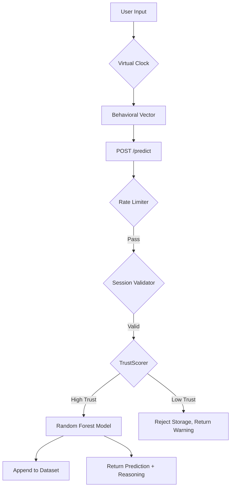

# Technical Architecture: Typing Behavior Sentiment Analyzer (v2.0)

**Project Links:**
*   **Live App:** [typingmoodai.onrender.com](https://typingmoodai.onrender.com/)
*   **GitHub Repository:** [github.com/garvjain7/typing-based-sentimental-analysis](https://github.com/garvjain7/typing-based-sentimental-analysis)

---

## 1. Abstract
The **Typing Behavior Sentiment Analyzer** is a production-grade Behavioral Biometric platform designed to predict psychological states (Happy, Neutral, Stressed) via psychomotor keystroke dynamics. Unlike traditional NLP, this system treats the keyboard as a biometric sensor, extracting high-fidelity rhythmic signatures that remain consistent across different languages and text contexts.

---

## 2. Theoretical Framework: Keystroke Dynamics
The core thesis relies on **Keystroke Dynamics**, a biometric modality that measures the timing of keyboard interactions. 
*   **Hold Time (Dwell Time)**: The duration from a key's compression to its release.
*   **Flight Time (Inter-Key Delay)**: The latency between independent key strikes.
*   **Cognitive Load Indicators**: Erratic fly rhythms and high pause variability serve as primary indicators of heightened cortisol (Stress), while fluid, high-velocity bursts define the "Flow State" (Happy).

---

## 3. The "Production-Grade" Security Stack
To prevent data contamination and bot-interference, the system implements a server-authoritative security layer.

### 🛡️ 3.1. Multivariate TrustScorer
Every submission is evaluated by a backend `TrustScorer` before it is accepted for prediction or storage.
*   **Humanity Ratio**: Compares `total_keys / text_length`. A ratio $< 0.7$ indicates text pasting or synthetic injection, triggering a "Low Trust" rejection.
*   **Rhythmic Fingerprinting**: Evaluates the `avg_inter_key_delay`. Signals $< 25$ms are flagged as bot-generated (scripted input), as this exceeds human neuromuscular limits.
*   **Velocity Thresholds**: WPM $> 180$ is flagged for scrutiny unless accompanied by high accuracy and consistent rhythm.

### ⚡ 3.2. Rate Limiting & Replay Protection
*   **Tokenized Sessions**: Every session must be initialized via `/session/start`, which binds a unique UUID to the user's IP.
*   **Immediate Replay Block**: A session ID is marked `used` the millisecond a prediction starts, preventing attackers from submitting the same high-trust data vector multiple times.
*   **IP-Level Throttling**: A 10-request-per-minute ceiling prevents brute-force attempts to "crack" the model's feature space.

---

## 4. The Engineering Engine: "The Virtual Clock"
One of the most innovative components is the **Virtual Session Clock** (`correctionOffset`). 

> [!IMPORTANT]
> **The Problem:** In a real-world web environment, users encounter network errors, server reboots, or confusing UI warnings. These "interruptions" create massive timing gaps that would ordinarily tank a user's WPM and rhythmic consistency, leading to "False Stressed" predictions.

### ⚙️ How it Works:
1.  **Gap Detection**: The system detects when a user is in a "Waiting" or "Error" state.
2.  **Time Freezing**: While waiting, the internal timer pauses.
3.  **Delta Correction**: When the user strikes a key to resume, the system calculates the `realNow - lastPauseStart` gap.
4.  **The Offset**: This gap is added to `state.correctionOffset`. Every subsequent behavioral timestamp is adjusted: `virtualTime = realTime - correctionOffset`.
5.  **Result**: The ML model receives a "Clean Stream" of typing data that looks like a continuous, uninterrupted human session.

---

## 5. Non-Blocking "Ever-Typing" UX
The frontend is built as a resilient state machine to ensure the user is never "trapped" by an error.
*   **Non-Destructive Failures**: Errors (422, 403, 429) do not lock the UI. They surface as actionable status messages (e.g., *"Session lost, click Reset"*).
*   **Atomic Reset**: The "Reset" button performs a surgical wipe of the client-side state machine without refreshing the browser, instantly preparing a new server-side session.
*   **Dynamic Guidance**: The UI pulsates critical recovery buttons (like Reset) when a fatal connection state is detected.

---

## 6. Admin Observatory: "Zero-Trust" Clean-URL
The Admin Dashboard (`/admin`) implements a high-security visualization layer for the behavioral dataset.

### 🔒 6.1. The "Clean-URL" Logic
To satisfy the requirement of **"Password on Refresh, Nav on Links,"** the system uses a clever browser-history hack:
1.  **Authorized Nav**: The "Next/Prev" links contain the password in the URL, allowing the server to authorize the GET request.
2.  **Instant Wipe**: As soon as the page loads, JavaScript runs: `history.replaceState('', '', '/admin?page=X')`.
3.  **The Trap**: This deletes the password from the address bar. If the user hits **Refresh (F5)**, the browser sends the "Clean URL" to the server.
4.  **Challenge**: The server sees no password -> Password prompt is triggered.

---

## 7. Data Storage & Deployment
*   **Storage**: Data is managed via `backend/storage.py` and saved to `typing_behavior_dataset.csv`.
*   **Render Deployment**: Utilizes a stateless ASGI server. 
    *   *Note:* Persistent storage requires a Render "Blue Disk" to survive redeployments.
*   **Interpretability**: Returns "Driving Factors" (Feature Importance) to the end-user to explain *why* the AI selected a specific mood.

